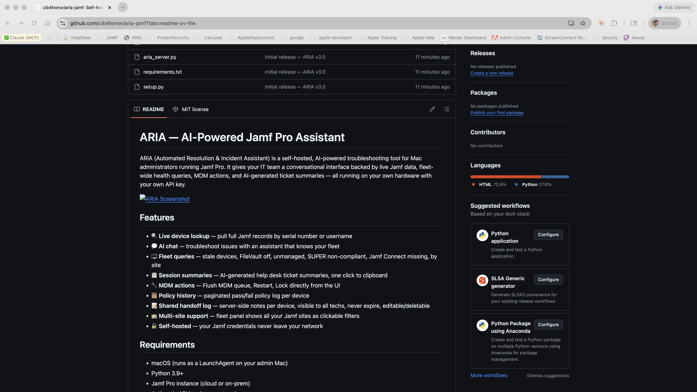

# ARIA — AI-Powered Jamf Pro Assistant

ARIA (Automated Resolution & Incident Assistant) is a self-hosted, AI-powered troubleshooting tool for Mac administrators running Jamf Pro. It gives your IT team a conversational interface backed by live Jamf data, fleet-wide health queries, MDM actions, and AI-generated ticket summaries — all running on your own hardware with your own API key.



## Features

- 🔍 **Live device lookup** — pull full Jamf records by serial number or username
- 💬 **AI chat** — troubleshoot issues with an assistant that knows your fleet
- 🖥 **Fleet queries** — stale devices, FileVault off, unmanaged, SUPER non-compliant, Jamf Connect missing, by site
- 📋 **Session summaries** — AI-generated help desk ticket summaries, one click to clipboard
- 🔧 **MDM actions** — Flush MDM queue, Restart, Lock directly from the UI
- 📜 **Policy history** — paginated pass/fail policy log per device
- 📝 **Shared handoff log** — server-side notes per device, visible to all techs, never expire, editable/deletable
- 🏫 **Multi-site support** — fleet panel shows all your Jamf sites as clickable filters
- 🔒 **Self-hosted** — your Jamf credentials never leave your network

## Requirements

- macOS (runs as a LaunchAgent on your admin Mac)
- Python 3.9+
- Jamf Pro instance (cloud or on-prem)
- Anthropic API key ([get one here](https://console.anthropic.com))

## Quick Start

### 1. Clone the repo

```bash
git clone https://github.com/YOUR_USERNAME/aria-jamf.git
cd aria-jamf
```

### 2. Create a virtual environment and install dependencies

```bash
python3 -m venv venv
source venv/bin/activate
pip install -r requirements.txt
```

### 3. Configure your environment

```bash
cp .env.example .env
```

Edit `.env` with your details — see [Configuration](#configuration) below.

### 4. Run the setup script to generate your SSL certificate

```bash
python3 setup.py
```

This generates a self-signed certificate for HTTPS. Follow the prompts to trust it on your Mac.

### 5. Start ARIA

```bash
python3 aria_server.py
```

Open your browser to `https://localhost:5001` (or `https://aria.local:5001` if you set your hostname).

### 6. (Optional) Install as a LaunchAgent so ARIA starts at login

```bash
python3 setup.py --install-launchagent
```

## Configuration

Copy `.env.example` to `.env` and fill in your values:

```env
# Jamf Pro — create an API role with read permissions
JAMF_URL=https://yourschool.jamfcloud.com
JAMF_CLIENT_ID=your-client-id
JAMF_CLIENT_SECRET=your-client-secret

# Anthropic — get your key at console.anthropic.com
ANTHROPIC_API_KEY=sk-ant-...

# ARIA settings
ARIA_PORT=5001
ARIA_API_KEY=generate-a-random-string-here

# Your organization name (shown in the UI)
ORG_NAME=Your Organization

# Comma-separated list of tech names for the login dropdown
TECH_NAMES=Alice,Bob,Carol,Dave

# Optional: Slack webhook for escalation notifications
SLACK_WEBHOOK_URL=
```

### Jamf Pro API Role Setup

In Jamf Pro, create a new API role (**Settings → System → API roles and clients**) with these privileges:

- Read Computers
- Read Computer Check-In
- Read Computer Inventory Collection
- Send Computer Remote Command to Restart

Then create an API client using that role and copy the Client ID and Secret to your `.env`.

## Customizing the AI

ARIA's system prompt is in `config/system_prompt.txt`. Edit it to add context specific to your environment:

- Software you deploy
- Common issues your techs encounter
- Your MDM workflow
- Printer setup, VPN, web filtering details

The more context you add, the better ARIA's answers will be.

## Customizing Extension Attributes

ARIA surfaces specific Jamf extension attributes in the device panel. The EA field names are configured in `config/extension_attributes.json`. Edit this file to match the EA names in your Jamf instance.

See `config/extension_attributes.example.json` for the structure.

## Custom Background Image

Drop any image file into `static/bg.jpg` to use it as the setup screen background. Recommended: a landscape photo relevant to your organization. ARIA darkens and overlays it automatically.

## HTTPS Certificate

ARIA uses a self-signed SSL certificate generated by `setup.py`. To trust it on client Macs:

1. Open Keychain Access
2. Import `aria-cert.pem` into the System keychain
3. Set it to "Always Trust"

To distribute trust to managed Macs, deploy a configuration profile. See `docs/cert-profile.md` for instructions.

## Security Notes

- ARIA is intended to run on your **administrator account** only — never expose it to student or staff user sessions
- The `ARIA_API_KEY` in `.env` is used to authenticate browser requests to the backend — generate a strong random string
- Do not expose ARIA's port to the public internet
- Your Jamf credentials are stored in `.env` and never leave your server

## Project Structure

```
aria-jamf/
├── aria_server.py          # Flask backend
├── setup.py                # Setup wizard + LaunchAgent installer
├── requirements.txt        # Python dependencies
├── .env.example            # Environment variable template
├── config/
│   ├── system_prompt.txt           # AI system prompt (customize this)
│   └── extension_attributes.json  # EA field names to surface in the UI
├── templates/
│   └── index.html          # Single-page frontend
├── static/
│   └── bg.jpg              # Background image (add your own)
├── docs/
│   ├── screenshot.png
│   └── cert-profile.md
└── handoff_log.json        # Created at runtime — shared tech notes
```

## Contributing

Pull requests welcome. If you add support for new EA fields, fleet queries, or MDM actions, please open a PR.

## License

MIT — see [LICENSE](LICENSE)

## Acknowledgements

Built with [Flask](https://flask.palletsprojects.com), [Claude](https://anthropic.com), and the [Jamf Pro API](https://developer.jamf.com).
